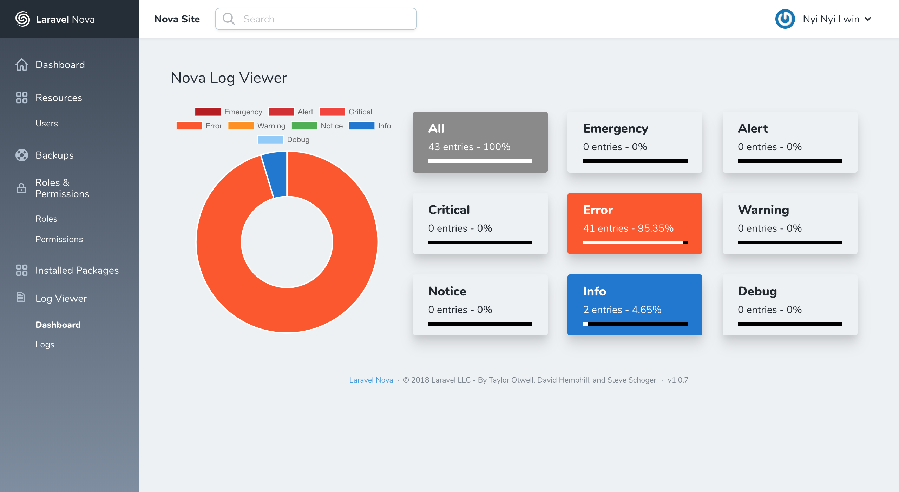
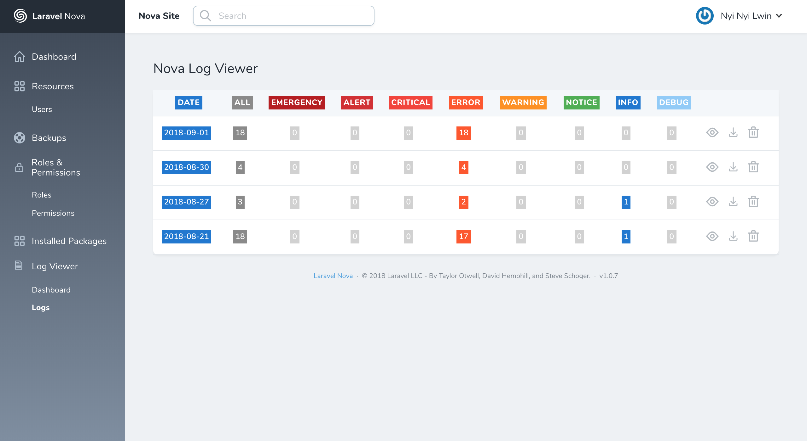
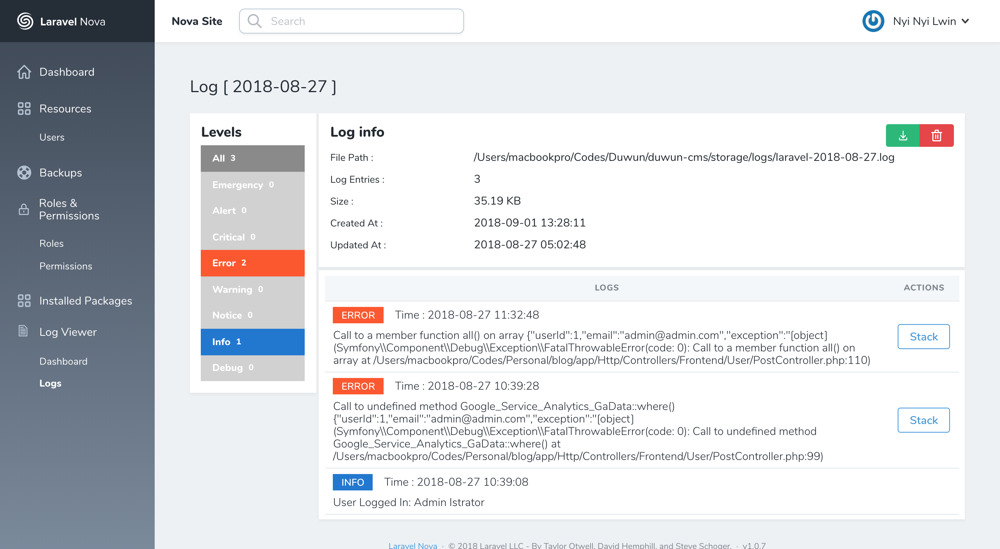

# Nova Log Viewer

[](https://packagist.org/packages/php-junior/nova-logs)
[](https://packagist.org/packages/php-junior/nova-logs)
[](https://app.fossa.io/projects/git%2Bgithub.com%2FPHPJunior%2Fnova-logs?ref=badge_shield)







## Installation

You can install the package in to a Laravel app that uses [Nova](https://nova.laravel.com) via composer:

```bash
composer require php-junior/nova-logs
```

**LogViewer** support only the **daily** log channel, so make sure that the `LOG_CHANNEL` is set to `daily` instead of `stack` in your `.env` file.

For Laravel 5.5 and below, set this in your `.env` file

`
APP_LOG=daily
`

Next up, you must register the tool with Nova. This is typically done in the `tools` method of the `NovaServiceProvider`.

```php
// in app/Providers/NovaServiceProvider.php

public function tools()
{
    return [
        // ...
        new \PhpJunior\NovaLogViewer\Tool(),
    ];
}
```

### Changelog

Please see [CHANGELOG](CHANGELOG.md) for more information on what has changed recently.

## Credits

- [ARCANEDEV](https://github.com/ARCANEDEV/LogViewer)

## License

The MIT License (MIT). Please see [License File](LICENSE.md) for more information.


[](https://app.fossa.io/projects/git%2Bgithub.com%2FPHPJunior%2Fnova-logs?ref=badge_large)